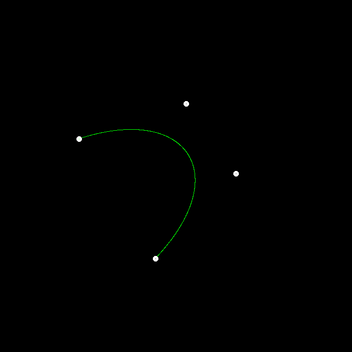
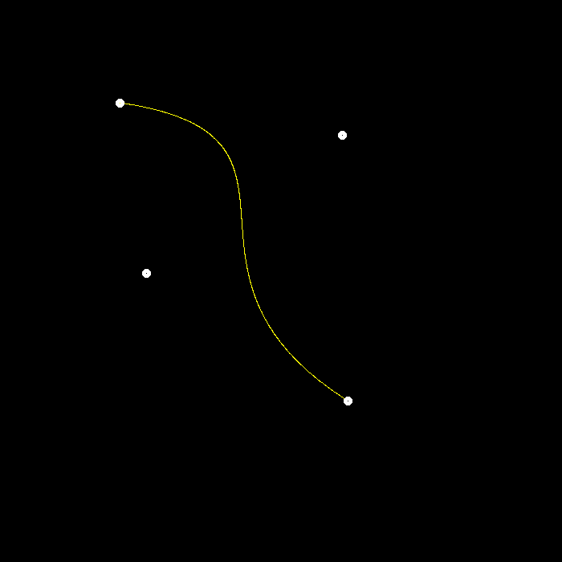
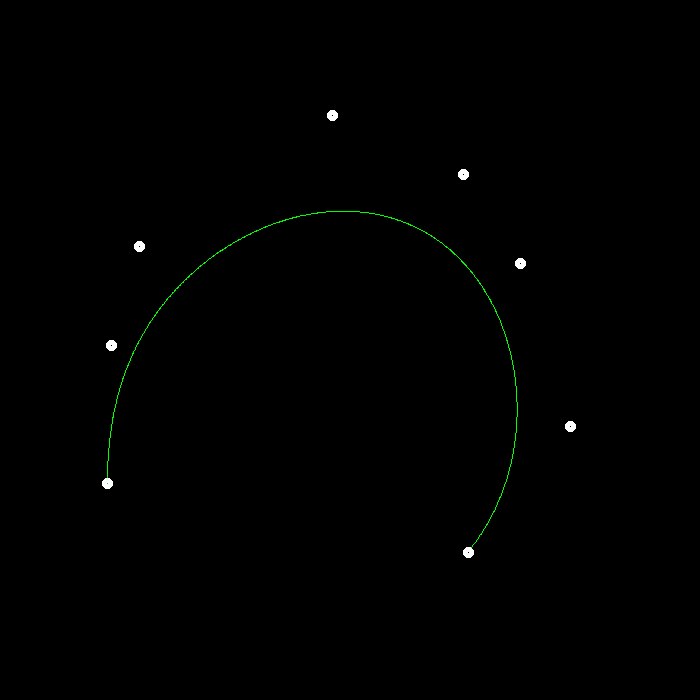
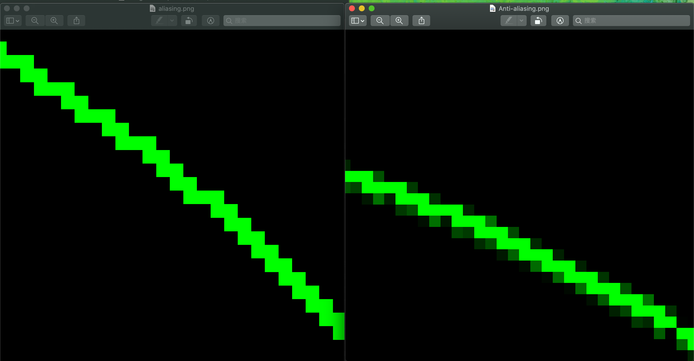

#### 1. 提交的格式正确，包含所有必须的文件。代码可以编译和运行。

#### 2. De Casteljau 算法: 对于给定的控制点，你的代码能够产生正确的 Bézier 曲线。

修改了`bezier`函数：迭代每个t，每次调用`recursive_bezier`函数求出点，同时赋给它绿色。

```c++
void bezier(const std::vector<cv::Point2f> &control_points, cv::Mat &window) 
{
    // TODO: Iterate through all t = 0 to t = 1 with small steps, and call de Casteljau's 
    // recursive Bezier algorithm.
    for(float t = 0.0; t <= 1.0; t += 0.001){
        auto point = recursive_bezier(control_points, t);
        window.at<cv::Vec3b>(point.y, point.x)[1] = 255;
    }
}
```

修改`recursive_bezier`函数，通过递归的方式求出中间点。

```c++
cv::Point2f recursive_bezier(const std::vector<cv::Point2f> &control_points, float t) 
{
    // TODO: Implement de Casteljau's algorithm
    if(control_points.size() == 1)
    {
        //std::cout << control_points[0].x << " " << control_points[0].y << std::endl;
        return cv::Point2f(control_points[0]);
    }
    else{
        std::vector<cv::Point2f> temp_points;
        for(int i = 0; i < control_points.size() - 1; i++){
            temp_points.emplace_back(control_points[i] * (1 - t) + control_points[i+1] * t);
        }
        return recursive_bezier(temp_points, t);
    }
}
```

#### 3. 结果图片

单条绿色线



同时调用 naive_bezier 和 bezier 函数



8个控制点的贝塞尔曲线（修改`main`函数和`mouse_handler`函数中点的个数）



#### 4. 实现对 Bézier 曲线的反走样。(对于一个曲线上的点，不只把它对应于一个像 素，你需要根据到像素中心的距离来考虑与它相邻的像素的颜色。)

关于反走样，我主要修改了`bezier`函数，我的方式时先求出该点邻近的四个点像素，分别求一下他们的欧氏距离，然后对四个像素分别做最小距离与该点与像素距离的比例来计算最后的颜色值。

```c++
void bezier(const std::vector<cv::Point2f> &control_points, cv::Mat &window) 
{
    // TODO: Iterate through all t = 0 to t = 1 with small steps, and call de Casteljau's 
    // recursive Bezier algorithm.
    for(float t = 0.0; t <= 1.0; t += 0.0001){
        auto point = recursive_bezier(control_points, t);

        int MAXX = ceil(point.x), MINX = floor(point.x);
        int MAXY = ceil(point.y), MINY = floor(point.y);

        float d00 = sqrt((point.x - MINX) * (point.x - MINX) + (point.y - MINY) * (point.y - MINY));
        float d01 = sqrt((point.x - MAXX) * (point.x - MAXX) + (point.y - MINY) * (point.y - MINY));
        float d10 = sqrt((point.x - MINX) * (point.x - MINX) + (point.y - MAXY) * (point.y - MAXY));
        float d11 = sqrt((point.x - MAXX) * (point.x - MAXX) + (point.y - MAXY) * (point.y - MAXY));

        float MinDis = std::min(d00, std::min(d01, std::min(d10, d11)));

        window.at<cv::Vec3b>(MINY, MINX)[1] = 255 * MinDis / d00;
        window.at<cv::Vec3b>(MINY, MAXX)[1] = 255 * MinDis / d01;
        window.at<cv::Vec3b>(MAXY, MINX)[1] = 255 * MinDis / d10;
        window.at<cv::Vec3b>(MAXY, MAXX)[1] = 255 * MinDis / d11;
        window.at<cv::Vec3b>(point.y, point.x)[1] = 255;
    }
}
```

对比结果如下：




