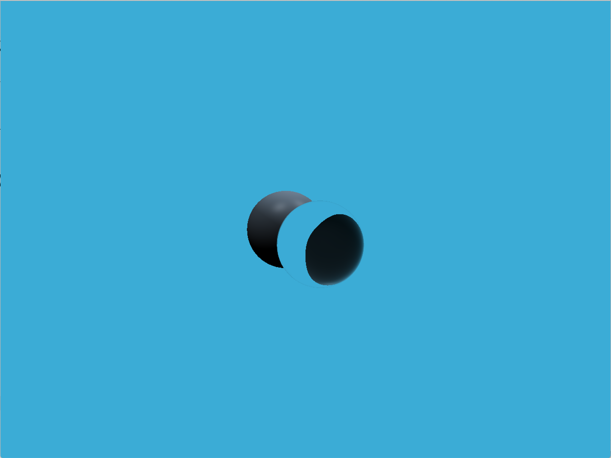
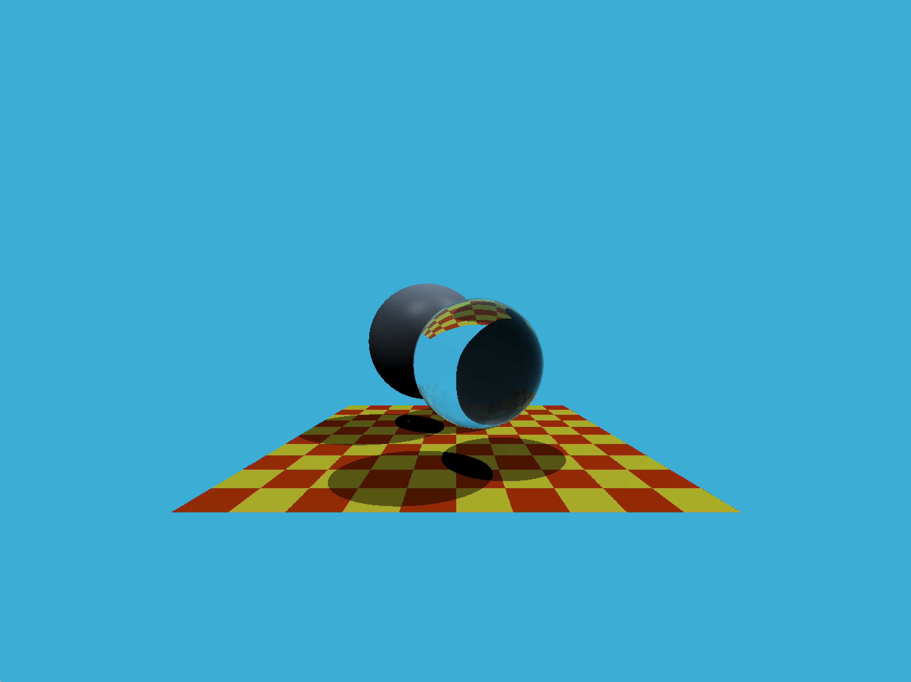

#### 1. 提交的格式正确，包含所有必须的文件。代码可以编译和运行。

#### 2. 光线生成

主要完成了`Render.cpp`中的`Render()`函数，内容如下：

```c++
void Renderer::Render(const Scene& scene)
{
    std::vector<Vector3f> framebuffer(scene.width * scene.height);

    float scale = std::tan(deg2rad(scene.fov * 0.5f));
    float imageAspectRatio = scene.width / (float)scene.height;

    // Use this variable as the eye position to start your rays.
    Vector3f eye_pos(0);
    int m = 0;
    for (int j = 0; j < scene.height; ++j)
    {
        for (int i = 0; i < scene.width; ++i)
        {
            // generate primary ray direction
            float x;
            float y;
            // TODO: Find the x and y positions of the current pixel to get the direction
            // vector that passes through it.
            // Also, don't forget to multiply both of them with the variable *scale*, and
            // x (horizontal) variable with the *imageAspectRatio*            

            x = (2 * (i + 0.5f) / (float)scene.width - 1) * imageAspectRatio * scale;
            y = (1 - 2 * (j + 0.5f) / (float)scene.height) * scale;

            Vector3f dir = normalize(Vector3f(x, y, -1)); // Don't forget to normalize this direction!
            framebuffer[m++] = castRay(eye_pos, dir, scene, 0);
        }
        UpdateProgress(j / (float)scene.height);
    }

    // save framebuffer to file
    FILE* fp = fopen("binary.ppm", "wb");
    (void)fprintf(fp, "P6\n%d %d\n255\n", scene.width, scene.height);
    for (auto i = 0; i < scene.height * scene.width; ++i) {
        static unsigned char color[3];
        color[0] = (int)(255 * clamp(0, 1, framebuffer[i].x));
        color[1] = (int)(255 * clamp(0, 1, framebuffer[i].y));
        color[2] = (int)(255 * clamp(0, 1, framebuffer[i].z));
        fwrite(color, 1, 3, fp);
    }
    fclose(fp);    
}
```

图像显示如下：



#### 3. 正确实现了 Moller-Trumbore 算法，并且能够看到图像中的地面。

主要完成了`Traingle.hpp`中的`rayTriangleIntersect()`函数，内容如下：

```c++
bool rayTriangleIntersect(const Vector3f& v0, const Vector3f& v1, const Vector3f& v2, const Vector3f& orig,const Vector3f& dir, float& tnear, float& u, float& v)
{
    // TODO: Implement this function that tests whether the triangle
    // that's specified bt v0, v1 and v2 intersects with the ray (whose
    // origin is *orig* and direction is *dir*)
    // Also don't forget to update tnear, u and v.

    Vector3f    E1 =   v1 - v0;
    Vector3f    E2 =   v2 - v0;
    Vector3f     S = orig - v0;
    Vector3f    S1 = crossProduct(dir, E2);
    Vector3f    S2 = crossProduct(S, E1);

    float     Left = 1.0f / dotProduct(S1, E1);

    tnear = Left * dotProduct(S2, E2);
        u = Left * dotProduct(S1, S);
        v = Left * dotProduct(S2, dir);

    return tnear > 0 && u >= 0 && v >= 0 && (1 - u - v) >= 0;
}
```

图像如下：

