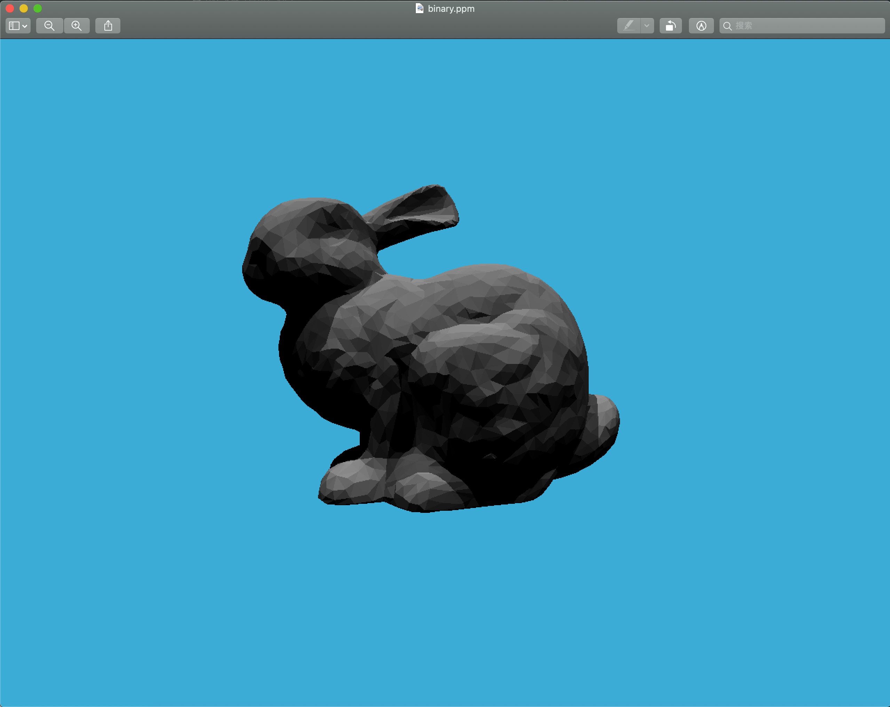

#### 提交格式正确，包含所有需要的文件;代码可以在虚拟机下正确 编译运行。

1. 修改`Renderer::Render`函数

```c++
void Renderer::Render(const Scene& scene)
{
    std::vector<Vector3f> framebuffer(scene.width * scene.height);

    float scale = tan(deg2rad(scene.fov * 0.5));
    float imageAspectRatio = scene.width / (float)scene.height;
    Vector3f eye_pos(-1, 5, 10);
    int m = 0;
    for (uint32_t j = 0; j < scene.height; ++j) {
        for (uint32_t i = 0; i < scene.width; ++i) {
            // generate primary ray direction
            float x = (2 * (i + 0.5) / (float)scene.width - 1) *
                      imageAspectRatio * scale;
            float y = (1 - 2 * (j + 0.5) / (float)scene.height) * scale;
            // TODO: Find the x and y positions of the current pixel to get the
            // direction
            //  vector that passes through it.
            // Also, don't forget to multiply both of them with the variable
            // *scale*, and x (horizontal) variable with the *imageAspectRatio*

            // Don't forget to normalize this direction!

            Vector3f dir = normalize(Vector3f(x, y, -1)); // Don't forget to normalize this direction!
            Ray ray(eye_pos, dir, 0.0);
            framebuffer[m++] = scene.castRay(ray, 0);
        }
        UpdateProgress(j / (float)scene.height);
    }
    UpdateProgress(1.f);

    // save framebuffer to file
    FILE* fp = fopen("binary.ppm", "wb");
    (void)fprintf(fp, "P6\n%d %d\n255\n", scene.width, scene.height);
    for (auto i = 0; i < scene.height * scene.width; ++i) {
        static unsigned char color[3];
        color[0] = (unsigned char)(255 * clamp(0, 1, framebuffer[i].x));
        color[1] = (unsigned char)(255 * clamp(0, 1, framebuffer[i].y));
        color[2] = (unsigned char)(255 * clamp(0, 1, framebuffer[i].z));
        fwrite(color, 1, 3, fp);
    }
    fclose(fp);    
}
```

2. 修改`Triangle::getIntersection(Ray ray)`函数

```c++
inline Intersection Triangle::getIntersection(Ray ray)
{
    Intersection inter;

    if (dotProduct(ray.direction, normal) > 0)
        return inter;
    double u, v, t_tmp = 0;
    Vector3f pvec = crossProduct(ray.direction, e2);
    double det = dotProduct(e1, pvec);
    if (fabs(det) < EPSILON)
        return inter;

    double det_inv = 1. / det;
    Vector3f tvec = ray.origin - v0;
    u = dotProduct(tvec, pvec) * det_inv;
    if (u < 0 || u > 1)
        return inter;
    Vector3f qvec = crossProduct(tvec, e1);
    v = dotProduct(ray.direction, qvec) * det_inv;
    if (v < 0 || u + v > 1)
        return inter;
    t_tmp = dotProduct(e2, qvec) * det_inv;

    // TODO find ray triangle intersection
    if(t_tmp < 0)return inter;

    inter.happened = true;
    inter.coords = ray(t_tmp);
    inter.distance = t_tmp;
    inter.m = m;
    inter.normal = normal;
    inter.obj = this;
    
    return inter;
}
```

#### 包围盒求交:正确实现光线与包围盒求交函数

```c++
inline bool Bounds3::IntersectP(const Ray& ray, const Vector3f& invDir,
                                const std::array<int, 3>& dirIsNeg) const
{
    // invDir: ray direction(x,y,z), invDir=(1.0/x,1.0/y,1.0/z), use this because Multiply is faster that Division
    // dirIsNeg: ray direction(x,y,z), dirIsNeg=[int(x>0),int(y>0),int(z>0)], use this to simplify your logic
    // TODO test if ray bound intersects

    double TminX = (pMin.x - ray.origin.x) * invDir.x;
    double TmaxX = (pMax.x - ray.origin.x) * invDir.x;
    double t;

    if(!dirIsNeg[0]){
        t = TminX;
        TminX = TmaxX;
        TmaxX = t;
    }

    double TminY = (pMin.y - ray.origin.y) * invDir.y;
    double TmaxY = (pMax.y - ray.origin.y) * invDir.y;
    if(!dirIsNeg[1]){
        t = TminY;
        TminY = TmaxY;
        TmaxY = t;
    }

    double TminZ = (pMin.z - ray.origin.z) * invDir.z;
    double TmaxZ = (pMax.z - ray.origin.z) * invDir.z;
    if(!dirIsNeg[2]){
        t = TminZ;
        TminZ = TmaxZ;
        TmaxZ = t;
    }

    double TEnter = fmax(fmax(TminX, TminY), TminZ);
    double TExit = fmin(fmin(TmaxX, TmaxY), TmaxZ);

    if(TEnter < TExit && TExit >= 0)return true;
    else return false;
}
```

#### BVH 查找:正确实现 BVH 加速的光线与场景求交

```c++
Intersection BVHAccel::getIntersection(BVHBuildNode* node, const Ray& ray) const
{
    // TODO Traverse the BVH to find intersection
    Vector3f InvDir(1.0 / ray.direction.x, 1.0/ray.direction.y, 1.0/ray.direction.z);
    std::array<int, 3> DirIsNeg{int(ray.direction.x > 0), int(ray.direction.y > 0), int(ray.direction.z > 0)};

    if(node->bounds.IntersectP(ray, InvDir, DirIsNeg)){
        if(node->left == nullptr && node->right == nullptr){
            return node->object->getIntersection(ray);
        }
        else {
            Intersection hit1 = getIntersection(node->left, ray);
            Intersection hit2 = getIntersection(node->right, ray);

            if(hit1.distance < hit2.distance)return hit1;
            else return hit2;
        }
    }
    else return Intersection();
}
```

图片：



#### SAH 查找:自学 SAH(Surface Area Heuristic) , 正确实现 SAH 加速，并且提交结果图片，并在 README.md 中说明 SVH 的实现方法，并对比 BVH、SVH 的时间开销
