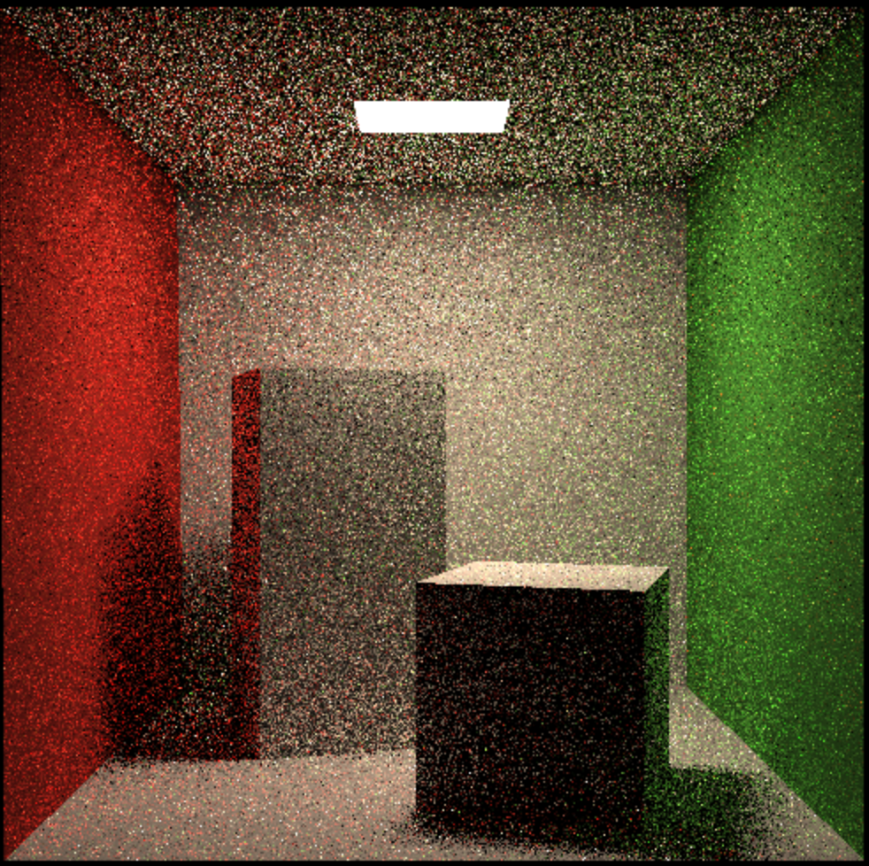
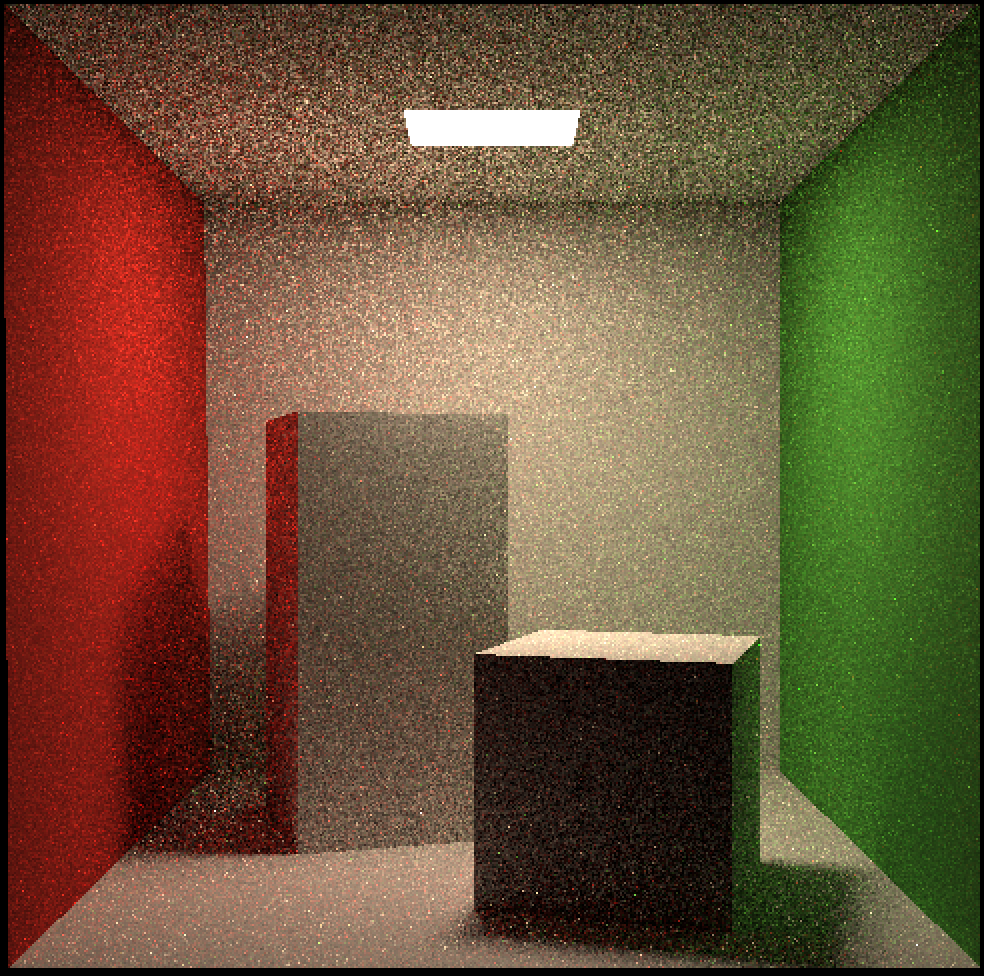
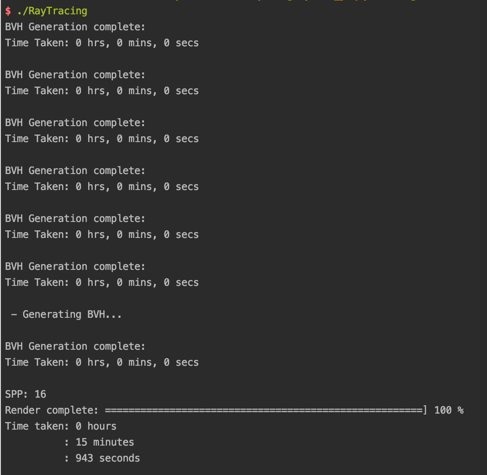

#### 1. 提交格式正确，包含所有需要的文件，代码可以在虚拟机下正确编译运行。

#### 2. Path Tracing: 正确实现 Path Tracing 算法，并提交分辨率 不小于 512*512，采样数不小于 8 的渲染结果图片。

完成`Scene::castRay`函数：

```c++
// Implementation of Path Tracing
Vector3f Scene::castRay(const Ray &ray, int depth) const
{
    // TO DO Implement Path Tracing Algorithm here
    Intersection intersection = intersect(ray);
    Vector3f L = Vector3f(0);
    if(intersection.happened){
        if(depth == 0 && intersection.m->hasEmission()){
            return intersection.m->getEmission();
        }

        Vector3f wo = normalize(-ray.direction);
        Vector3f p = intersection.coords;
        Vector3f n = normalize(intersection.normal);

        float pdf_light = 0.0f;
        Intersection inter;
        sampleLight(inter, pdf_light);

        Vector3f x =inter.coords;
        Vector3f ws = normalize(x - p);
        Vector3f nn = normalize(inter.normal);

        bool blocked = (intersect(Ray(p, ws)).coords - x).norm() > EPSILON;
        Vector3f L_dir = Vector3f(0.0f);

        if(!blocked){
            float dist = (x-p).norm();
            L_dir = inter.emit * intersection.m->eval(wo, ws, n) * dotProduct(ws, n) * dotProduct(-ws, nn) / (dist * dist * pdf_light);
        }

        Vector3f L_indir = Vector3f(0.0f);
        float P_RR = get_random_float();

        if(P_RR < Scene::RussianRoulette){
            Vector3f wi = intersection.m->sample(wo,n);
            Ray r(p, wi);
            Intersection q = Scene::intersect(r);

            if(q.happened){
                bool hitIsEmitting = !q.m->hasEmission();
                if(hitIsEmitting){
                    L_indir = castRay(r, depth + 1) * intersection.m->eval(wo,wi,n)*dotProduct(wi, n)/(intersection.m->pdf(wo,wi, n) * Scene::RussianRoulette);
                }
            }
        }
        L = L_dir + L_indir;
    }
    return L;
}
```

512*512，SSP=2结果：



512*512，SSP=16结果：



时间：



#### 3. 多线程: 将多线程应用在Ray Generation上，注意实现时可能涉及的冲突。

在`Renderer.cpp`中通过openmp实现多线程

```c++
void Renderer::Render(const Scene& scene)
{
    std::vector<Vector3f> framebuffer(scene.width * scene.height);

    float scale = tan(deg2rad(scene.fov * 0.5));
    float imageAspectRatio = scene.width / (float)scene.height;
    Vector3f eye_pos(278, 273, -800);
    int m = 0;
    float mMax = (float)scene.height * (float)scene.width;

    // change the spp value to change sample ammount
    int spp = 16;
    int NUM_THREAD = 8;
    std::cout << "SPP: " << spp << "\n";

    #pragma omp parallel for num_threads(NUM_THREAD) collapse(2) schedule(dynamic, 4)
    for (uint32_t j = 0; j < scene.height; ++j) {
        for (uint32_t i = 0; i < scene.width; ++i) {
            // generate primary ray direction
            float x = (2 * (i + 0.5) / (float)scene.width - 1) *
                      imageAspectRatio * scale;
            float y = (1 - 2 * (j + 0.5) / (float)scene.height) * scale;

            Vector3f dir = normalize(Vector3f(-x, y, 1));

            thread_local Vector3f color;
            color = Vector3f(0.0f);

            for (int k = 0; k < spp; k++){
                color += scene.castRay(Ray(eye_pos, dir), 0) / spp;
            }
            framebuffer[j * scene.width + i] += color;
            {
                m++;
                UpdateProgress((float)m / mMax);
            }

        }
    }
    UpdateProgress(1.f);

    // save framebuffer to file
    FILE* fp = fopen("binary.ppm", "wb");
    (void)fprintf(fp, "P6\n%d %d\n255\n", scene.width, scene.height);
    for (auto i = 0; i < scene.height * scene.width; ++i) {
        static unsigned char color[3];
        color[0] = (unsigned char)(255 * std::pow(clamp(0, 1, framebuffer[i].x), 0.6f));
        color[1] = (unsigned char)(255 * std::pow(clamp(0, 1, framebuffer[i].y), 0.6f));
        color[2] = (unsigned char)(255 * std::pow(clamp(0, 1, framebuffer[i].z), 0.6f));
        fwrite(color, 1, 3, fp);
    }
    fclose(fp);
}
```

#### 4. Microfacet: 正确实现Microfacet材质，并提交可体现Microfacet性质的渲染结果。

未完成


