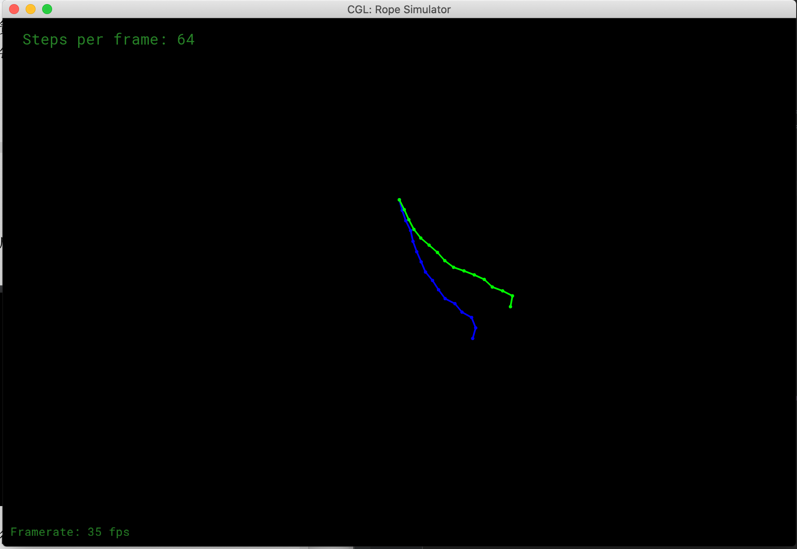
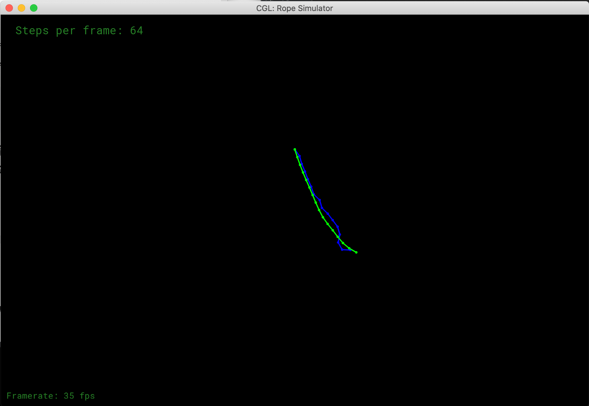

#### 1. 提交的格式正确，包含所有必须的文件。代码可以编译和运行。 

#### 2. 连接绳子约束，正确的构造绳子

实现Rope的构造函数`Rope::Rope`：

```c++
Rope::Rope(Vector2D start, Vector2D end, int num_nodes, float node_mass, float k, vector<int> pinned_nodes)
{
    // TODO (Part 1): Create a rope starting at `start`, ending at `end`, and containing `num_nodes` nodes.

    Vector2D ARopeLen = (end - start) / (num_nodes - 1);

    for(int i = 0; i < num_nodes; i++){
      Vector2D pos = start + ARopeLen * i;
      masses.push_back(new Mass(pos, node_mass, false));
      if(i != 0){
        springs.push_back(new Spring(masses[i-1], masses[i], k));
      }
      //            pinned_nodes.push_back(i);
    }
    masses[0]->pinned= true;
    //        Comment-in this part when you implement the constructor
    //        for (auto &i : pinned_nodes) {
    //            masses[i]->pinned = true;
    //        }
}
```


#### 3. 半隐式欧拉法

实现函数`Rope::simulateEuler`：

```c++
void Rope::simulateEuler(float delta_t, Vector2D gravity)
{
  for (auto &s : springs)
  {
    // TODO (Part 2): Use Hooke's law to calculate the force on a node
    auto PosDiff = s->m1->position - s->m2->position;
    auto fab = -s->k * PosDiff.unit() * (PosDiff.norm() - s->rest_length);
    auto fba = -fab;
    
    s->m1->forces += fab;
    s->m2->forces += fba;
  }

  int pos = 0;
  for (auto &m : masses)
  {
  	if (!m->pinned)
  	{
      // TODO (Part 2): Add the force due to gravity, then compute the new velocity and position
      m->forces += gravity * m->mass;
      auto a = m->forces / m->mass;
      auto vt = m->velocity;

      m->velocity = vt + delta_t * a;

      // semi-implicit method
      m->position = m->position + delta_t * m->velocity;
      // TODO (Part 2): Add global damping
      m->velocity = (1-0.00005)*m->velocity;
    }
    // Reset all forces on each mass
    m->forces = Vector2D(0, 0);
  }
}
```


#### 4. 显式欧拉法

在函数`Rope::simulateEuler`中添加显示实现方法：

```c++
void Rope::simulateEuler(float delta_t, Vector2D gravity)
{
  for (auto &s : springs)
  {
    // TODO (Part 2): Use Hooke's law to calculate the force on a node
    auto PosDiff = s->m1->position - s->m2->position;
    auto fab = -s->k * PosDiff.unit() * (PosDiff.norm() - s->rest_length);
    auto fba = -fab;

    s->m1->forces += fab;
    s->m2->forces += fba;
  }

  int pos = 0;
  for (auto &m : masses)
  {
    if (!m->pinned)
    {
      // TODO (Part 2): Add the force due to gravity, then compute the new velocity and position
      m->forces += gravity * m->mass;
      auto a = m->forces / m->mass;
      auto vt = m->velocity;

      m->velocity = vt + delta_t * a;

      //                // semi-implicit method
      //                m->position = m->position + delta_t * m->velocity;

      // explicit method
      m->position = m->position + vt * delta_t;

      // TODO (Part 2): Add global damping
      m->velocity = (1-0.00005)*m->velocity;
    }
    // Reset all forces on each mass
    m->forces = Vector2D(0, 0);
  }
}
```


#### 5. 显式 Verlet

实现`Rope::simulateVerlet`函数：

```c++
void Rope::simulateVerlet(float delta_t, Vector2D gravity)
{
  for (auto &s : springs)
  {
    // TODO (Part 3): Simulate one timestep of the rope using explicit Verlet （solving constraints)
    auto PosDiff = s->m1->position - s->m2->position;

    if(!s->m1->pinned)s->m1->position += 0.5 * ((-PosDiff).norm() - s->rest_length) * ((-PosDiff).unit());
    if(!s->m2->pinned)s->m2->position += 0.5 * ((-PosDiff).norm() - s->rest_length) * (PosDiff.unit());
  }

  for (auto &m : masses)
  {
    if (!m->pinned)
    {
      Vector2D temp_position = m->position;
      // TODO (Part 3.1): Set the new position of the rope mass

      m->forces += gravity * m->mass;
      auto a = gravity;
      auto vt = m->velocity;

      m->velocity = vt + delta_t * a;
      m->position = m->position + (m->position - m->last_position) + delta_t * delta_t * a;
      m->last_position = temp_position;
      // TODO (Part 4): Add global Verlet damping
    }
  }
}
```



#### 6. 阻尼

修改`Rope::simulateVerlet`函数：

```c++
void Rope::simulateVerlet(float delta_t, Vector2D gravity)
{
  for (auto &s : springs)
  {
    // TODO (Part 3): Simulate one timestep of the rope using explicit Verlet （solving constraints)
    auto PosDiff = s->m1->position - s->m2->position;

    if(!s->m1->pinned)s->m1->position += 0.5 * ((-PosDiff).norm() - s->rest_length) * ((-PosDiff).unit());
    if(!s->m2->pinned)s->m2->position += 0.5 * ((-PosDiff).norm() - s->rest_length) * (PosDiff.unit());
  }

  for (auto &m : masses)
  {
    if (!m->pinned)
    {
      Vector2D temp_position = m->position;
      // TODO (Part 3.1): Set the new position of the rope mass

      m->forces += gravity * m->mass;
      auto a = gravity;
      auto vt = m->velocity;

      m->velocity = vt + delta_t * a;

      // TODO (Part 4): Add global Verlet damping
      float damping_factor = 0.00005;
      m->position = m->position + (1 - damping_factor) * (m->position - m->last_position) + delta_t * delta_t * a;
      m->last_position = temp_position;
    }
  }
}
```

