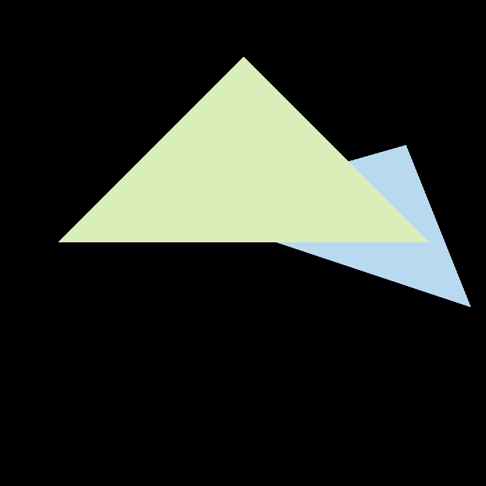

Games101：现代计算机图形学入门
- 课程主页：https://sites.cs.ucsb.edu/~lingqi/teaching/games101.html
- 课程BBS：http://games-cn.org/forums/forum/graphics-intro/
- 课程视频：https://www.bilibili.com/video/BV1X7411F744?spm_id_from=333.999.0.0

## Games101：现代计算机图形学入门

### 作业1：旋转与投影

初始结果：

逆时针旋转50度：

顺时针旋转50度：

### 作业2：Triangles and Z-buffering

未处理：

4xMSAA：

MSAA_逆向：

4xMSAA_逆向：

9xMSAA_逆向：

64xMSAA_逆向：

100xMSAA_逆向：

### 作业3：Pipeline and Shading

spot_normal:

spot_phone:

spot_texture:

spot_bump:

spot_displacement:

spot_BaseTexture:

Compare1:

Compare2:

rock_SmallTexture：

### 作业4：Bézier 曲线

bezier_curve：

bezier_curve：

bezier_curve_8num：

compare：

### 作业5：光线与三角形相交

two_ball：

ball_and_ground：

### 作业6：加速结构

### 作业7：路径追踪

### 作业8：质点弹簧系统

